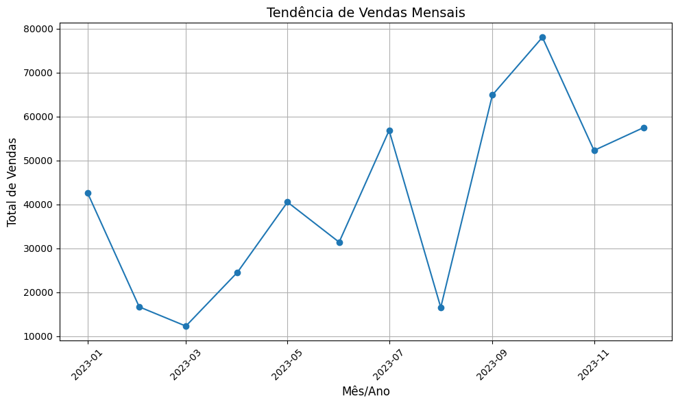

# Relatório de Análise de Vendas com Dados Quantitativos

## Principais Insights:

1. Tendência Mensal de Vendas: O gráfico ilustra a variação no total de vendas ao longo de 2023. Observamos um pico significativo de vendas no mês de setembro, atingindo aproximadamente R$80.000,00, enquanto os valores mais baixos foram registrados em março, com vendas em torno de R$10.000,00.

2. Produtos com Melhor Desempenho: O produto com maior contribuição para as vendas foi o Smartphone, com um total de vendas de R$18.210,10. Essa categoria lidera devido à sua alta demanda e preço unitário elevado.

3. Sazonalidade e Recuperação de Vendas: O desempenho de vendas apresentou uma queda no primeiro trimestre do ano, seguido por uma recuperação gradual até alcançar o pico em setembro. Após isso, observou-se uma redução significativa, seguida de uma estabilização nos últimos meses.

## Recomendações Estratégicas:

1. Aproveitar Sazonalidades: Planejar campanhas promocionais agressivas para o terceiro trimestre, especialmente no mês de setembro, que apresenta maior potencial de vendas.

2. Fortalecer Categorias de Alta Demanda: Focar no estoque e marketing de produtos como Smartphones e outros eletrônicos, que possuem maior peso nas vendas totais.

3. Revitalizar Períodos de Baixa: Realizar promoções ou eventos exclusivos durante meses de baixa performance, como março, para reduzir os impactos da sazonalidade negativa.

4. Otimizar Estoque: Reavaliar os produtos de menor desempenho, como camisa e tênis, e ajustar a estratégia de reposição para melhorar o giro de estoque, especialmente em períodos de queda.